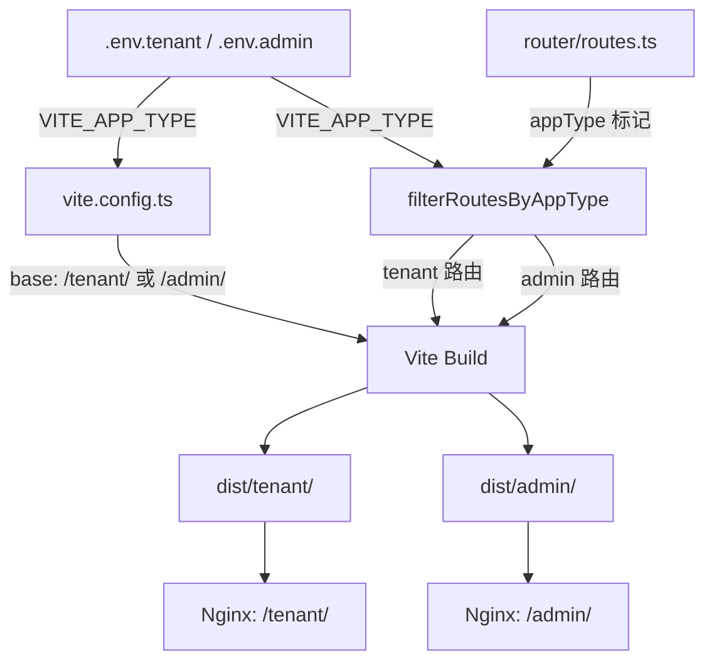

## Product Overview

将现有 QTrans 前端应用拆分为"租户面（用户面）"和"管理面"两个独立部署单元，通过 Vite 环境变量控制，实现从开发、构建到部署、访问的全面隔离。

## Core Features

- **环境变量驱动拆分**：新增 `VITE_APP_TYPE` 环境变量（`tenant` | `admin`），控制构建时仅包含对应面的路由和菜单
- **分环境打包**：`pnpm dev:tenant` / `pnpm dev:admin` 分别启动不同面的开发服务器（不同端口和文根）；`pnpm build:tenant` / `pnpm build:admin` 分别构建不同产物（不同 base）
- **文根隔离**：租户面 `base=/tenant/`，管理面 `base=/admin/`，支持同域名不同路径部署
- **路由互斥**：构建时根据 `VITE_APP_TYPE` 静态裁剪路由表，管理面不注册租户面路由，反之亦然；运行时路由守卫兜底拦截
- **菜单过滤**：侧边栏菜单仅显示当前面允许的菜单项，跨面菜单完全不可见
- **完全共用**：Layout（DefaultLayout / BlankLayout）、Header、组件、stores、utils、api 等代码完全共用，无重复

## Tech Stack

- Vue 3 + TypeScript + Vite + Vue Router + Pinia + Arco Design（现有技术栈不变）

## Implementation Approach

采用 **单仓库 + 环境变量 + 构建时分包** 的方案。核心思路：在 Vite 构建时通过 `VITE_APP_TYPE` 环境变量决定注册哪些路由和菜单，管理面和租户面共享所有非路由相关的代码。

### 关键技术决策

1. **路由拆分方式：构建时静态裁剪而非运行时动态过滤** — 同一份 `routes.ts` 中为每个路由标记 `appType: 'tenant' | 'admin' | 'shared'`，构建时通过 `filterRoutesByAppType()` 仅注册匹配的路由。优点：产物更小、无运行时开销、不可能通过运行时 hack 访问跨面路由。
2. **环境文件命名：`.env.tenant` / `.env.admin`** — 遵循 Vite 的 `--mode` 惯例，`vite --mode tenant` 自动加载 `.env.tenant`。dev / production 各有一份。
3. **开发服务器端口隔离**：租户面 `3000`，管理面 `3001`，避免 cookie/token 冲突。
4. **路由守卫兜底**：除构建时裁剪外，运行时 `beforeEach` 仍检查 `meta.appType`，作为双重保险。若通过某种方式访问到不匹配的路由，重定向到当前面的首页或 404。

### 实施步骤

1. 定义路由面归属标记（`appType` meta 字段）
2. 创建 `.env.tenant` / `.env.admin` 环境文件
3. 修改 `routes.ts` — 按面分类标记 + 构建时过滤函数
4. 修改路由守卫 — 增加 `appType` 检查
5. 修改 `menuRoutes` 导出 — 按面过滤菜单
6. 修改 `vite.config.ts` — 根据 `VITE_APP_TYPE` 设置 `base`
7. 添加 npm scripts（dev:tenant, dev:admin, build:tenant, build:admin）
8. 更新类型声明、Nginx 部署说明文档

### 性能与可靠性

- 构建时裁剪确保产物只包含当前面的路由 chunk，减小 bundle 体积
- 共享组件/store/api 不会有 tree-shaking 问题，因为它们本身就是全量共用的
- 路由守卫仅增加一个简单的字符串比较判断，无性能影响

## Architecture Design



### 数据流

```
用户请求 → Nginx (/tenant/ 或 /admin/) → 静态资源 (base 匹配)
  → Vue Router (仅注册对应面的路由)
  → beforeEach 守卫 (appType 兜底检查)
  → 渲染对应面的菜单和页面
```

## Implementation Notes

- `request.ts` 中 `window.location.href = '/login'` 等硬编码路径需改为基于 `import.meta.env.BASE_URL` 的相对路径
- `AppHeader.vue` 中的 logo 图片路径 `/figma/...` 需确保在带 base 前缀时仍可访问
- `index.html` 中 favicon 路径 `/favicon.svg` 需改为相对路径或带 base 前缀
- Pinia persistedstate 的 storage key 需根据 `VITE_APP_TYPE` 区分，避免两面的 store 数据互相覆盖

## Directory Structure

```
qtrans-frontend/
├── .env.development           # [MODIFY] 现有开发环境变量（保留，用于默认开发）
├── .env.production            # [MODIFY] 现有生产环境变量（保留，用于默认构建）
├── .env.tenant                # [NEW] 租户面环境变量（VITE_APP_TYPE=tenant, VITE_APP_TITLE=QTrans-租户端）
├── .env.admin                 # [NEW] 管理面环境变量（VITE_APP_TYPE=admin, VITE_APP_TITLE=QTrans-管理端）
├── .env.tenant.development    # [NEW] 租户面开发环境变量（port=3000）
├── .env.admin.development     # [NEW] 管理面开发环境变量（port=3001）
├── index.html                 # [MODIFY] favicon 路径改为可带 base 前缀
├── vite.config.ts             # [MODIFY] 根据 VITE_APP_TYPE 动态设置 base 和 port
├── package.json               # [MODIFY] 添加 dev:tenant, dev:admin, build:tenant, build:admin scripts
├── src/
│   ├── env.d.ts               # [MODIFY] 新增 VITE_APP_TYPE 类型声明
│   ├── router/
│   │   ├── index.ts           # [MODIFY] 使用过滤后的路由
│   │   ├── routes.ts          # [MODIFY] 为每个路由添加 appType 标记，导出 filterRoutesByAppType
│   │   └── guards.ts          # [MODIFY] 增加 appType 兜底检查守卫
│   ├── utils/
│   │   └── request.ts         # [MODIFY] 硬编码路径改为基于 BASE_URL
│   └── components/common/
│       └── AppHeader.vue      # [MODIFY] 资源路径适配 base 前缀
```