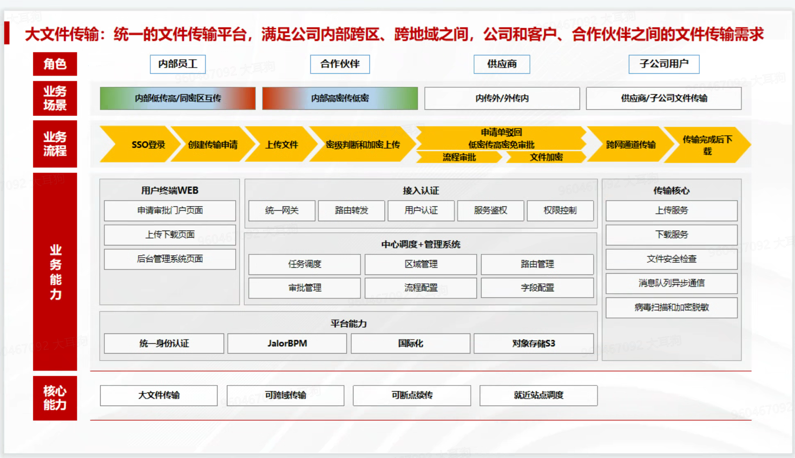

# 大文件传输平台设计说明书

**版本**: v1.0.0  
**编制日期**: 2026-03-02

---

## 目录

1. [引言](#1-引言)
   - 1.1 编写目的
   - 1.2 软件开发平台说明
   - 1.3 术语与缩写
2. [总体设计](#2-总体设计)
   - 2.1 系统架构
   - 2.2 技术选型
   - 2.3 核心模块划分
3. [模块描述](#3-模块描述)
   - 3.1 总体架构描述
   - 3.2 前端架构
   - 3.3 后端架构
4. [详细功能介绍](#4-详细功能介绍)
   - 4.1 WEB UI层
   - 4.2 管理页面
   - 4.3 业务模块

---

## 1. 引言

### 1.1 编写目的

本文档旨在详细描述B端企业跨安全域大文件传输平台的技术设计方案，作为后续开发、测试和部署的依据。

本文档的目标读者包括：
- 项目经理和技术负责人
- 开发团队成员
- 测试团队成员
- 运维部署人员

### 1.2 软件开发平台说明

#### 1.2.1 框架及关键技术

**前端技术栈：**

| 类别 | 技术选型 | 版本要求 |
|------|---------|---------|
| 开发语言 | TypeScript | ^5.0.0 |
| 核心框架 | Vue 3 (Composition API) | ^3.4.0 |
| 构建工具 | Vite | ^5.0.0 |
| UI组件库 | ArcoDesign Vue | ^2.50.0 |
| 路由管理 | Vue Router | ^4.2.0 |
| 状态管理 | Pinia | ^2.1.0 |
| HTTP客户端 | Axios | ^1.6.0 |
| 样式预处理器 | SCSS | - |
| 单元测试 | Vitest | ^1.0.0 |

**后端技术栈：**

| 类别 | 技术选型 | 说明 |
|------|---------|------|
| 开发语言 | Java | JDK 17+ |
| 核心框架 | Spring Boot | 企业级应用框架 |
| 持久层框架 | MyBatis-Plus | 简化CRUD操作 |
| 数据库 | MySQL 8.0 | 主数据存储 |
| 缓存 | Redis | 会话缓存、热点数据 |
| 消息队列 | RabbitMQ | 异步任务处理 |
| 文件存储 | MinIO/S3 | 大文件对象存储 |
| 服务容器 | Docker | 容器化部署 |
| 编排工具 | Kubernetes | 容器编排（可选） |

#### 1.2.2 部署运行容器

系统采用微服务架构部署，主要包含以下服务容器：

- **网关服务(Gateway)**：统一API网关，负责请求路由、负载均衡
- **用户服务(User Service)**：用户认证、权限管理
- **申请单服务(Application Service)**：申请单CRUD、流程管理
- **文件服务(File Service)**：文件上传、下载、存储管理
- **审批服务(Approval Service)**：审批流程、任务调度
- **传输服务(Transfer Service)**：文件传输、进度管理
- **日志服务(Log Service)**：日志采集、审计管理
- **通知服务(Notification Service)**：消息通知

#### 1.2.3 数据库

主数据库采用MySQL 8.0，主要数据表包括：

| 表名 | 说明 |
|------|------|
| sys_user | 用户信息表 |
| sys_role | 角色信息表 |
| sys_permission | 权限信息表 |
| sys_department | 部门组织表 |
| sys_dict | 数据字典表 |
| biz_application | 申请单主表 |
| biz_application_file | 申请单文件表 |
| biz_approval_record | 审批记录表 |
| biz_transfer_task | 传输任务表 |
| biz_transfer_file | 传输文件表 |
| log_operation | 操作日志表 |
| log_login | 登录日志表 |
| log_transfer | 传输日志表 |
| cfg_approval_flow | 审批流程配置表 |
| cfg_transfer_param | 传输参数配置表 |
| cfg_region | 区域配置表 |
| cfg_channel | 传输通道配置表 |

### 1.3 术语与缩写

| 术语 | 说明 |
|------|------|
| 安全域 | 具有相同安全策略的网络区域，如内网、外网、低密区、高密区 |
| 绿区 | 低密区域（Low Security Zone），对数据安全要求较低的区域 |
| 黄区 | 中密区域（Medium Security Zone），对数据安全要求中等的区域 |
| 红区 | 高密区域（High Security Zone），对数据安全要求最高的区域 |
| RBAC | 基于角色的访问控制（Role-Based Access Control） |
| SSO | 单点登录（Single Sign-On） |
| 断点续传 | 上传中断后可从断点位置继续上传，无需重新开始 |
| 分片上传 | 将大文件分割为多个小片段分别上传，提高上传效率和可靠性 |

---

## 2. 总体设计

### 2.1 系统架构

系统采用前后分离架构，前端负责用户交互和界面展示，后端提供RESTful API服务，通过统一网关进行请求路由和安全控制。

#### 2.1.1 整体架构图



**图 2-1 系统整体架构图**

#### 2.1.2 架构层次

系统分为以下几个层次：

1. **用户交互层(UI Layer)**：Vue 3前端应用，提供用户操作界面
2. **接入层(Access Layer)**：Nginx反向代理，统一网关服务
3. **服务层(Service Layer)**：业务微服务集群，处理核心业务逻辑
4. **数据层(Data Layer)**：MySQL数据库、Redis缓存、对象存储
5. **传输层(Transfer Layer)**：专用文件传输服务，支持跨安全域传输

### 2.2 技术选型

**前端技术选型理由：**

- **Vue 3 + Composition API**：提供更好的TypeScript支持和代码组织方式
- **Vite**：极快的开发启动速度和热更新体验
- **ArcoDesign**：企业级Vue组件库，提供丰富的业务组件
- **Pinia**：轻量级状态管理，支持持久化
- **Axios**：成熟的HTTP客户端，支持请求拦截和统一错误处理

**后端技术选型理由：**

- **Spring Boot**：成熟的企业级框架，生态丰富
- **MyBatis-Plus**：简化数据库操作，提高开发效率
- **RabbitMQ**：可靠的消息队列，支持多种消息模式
- **MinIO**：S3兼容的对象存储，适合大文件存储场景

### 2.3 核心模块划分

系统核心业务模块划分如下：

| 模块名称 | 模块说明 | 主要职责 |
|---------|---------|---------|
| 认证授权模块 | Authentication | 用户登录、Token管理、权限验证、SSO集成 |
| 申请单模块 | Application | 申请单创建、编辑、查询、状态流转 |
| 文件管理模块 | File | 文件上传、下载、预览、分片管理、断点续传 |
| 审批流程模块 | Approval | 审批任务分配、审批操作、流程配置 |
| 传输管理模块 | Transfer | 传输任务调度、进度监控、传输控制 |
| 用户管理模块 | User | 用户CRUD、角色权限配置 |
| 系统配置模块 | Config | 审批流程配置、传输参数配置、区域配置 |
| 日志审计模块 | Log | 操作日志、登录日志、传输日志、审计报告 |
| 通知中心模块 | Notification | 站内消息、邮件通知、短信通知 |

---

## 3. 模块描述

### 3.1 总体架构描述

系统采用前后端分离架构，前端基于Vue 3构建单页应用，后端基于Spring Boot构建微服务。整体架构遵循以下设计原则：

- **高内聚低耦合**：各模块职责明确，模块间通过接口通信
- **可扩展性**：支持水平扩展，可根据负载动态调整实例数量
- **高可用性**：关键服务集群部署，避免单点故障
- **安全性**：多层安全防护，包括身份认证、权限控制、数据加密
- **可观测性**：完整的日志记录和监控告警机制

### 3.2 前端架构

#### 3.2.1 前端技术架构

前端采用Vue 3 + TypeScript构建，主要特性包括：

- **Composition API**：更好的逻辑复用和代码组织
- **TypeScript**：类型安全，提高代码质量和可维护性
- **Pinia状态管理**：集中管理应用状态，支持持久化
- **Vue Router**：前端路由，支持路由守卫和权限控制
- **Axios封装**：统一请求处理，Token自动刷新，错误统一处理

#### 3.2.2 前端目录结构

```
src/
├── api/              # API接口定义
├── assets/           # 静态资源
├── components/       # 公共组件
│   ├── common/       # 通用组件
│   └── business/     # 业务组件
├── composables/      # 组合式函数
├── layouts/          # 布局组件
├── router/           # 路由配置
├── stores/           # 状态管理
├── styles/           # 全局样式
├── types/            # 类型定义
├── utils/            # 工具函数
├── views/            # 页面组件
├── App.vue
└── main.ts
```

### 3.3 后端架构

#### 3.3.1 微服务架构

后端采用微服务架构，各服务职责清晰，独立部署和扩展：

- **网关服务**：统一入口，负责路由、限流、熔断
- **用户服务**：用户、角色、权限管理
- **申请单服务**：申请单全生命周期管理
- **文件服务**：文件上传、下载、存储管理
- **审批服务**：审批流程、任务调度
- **传输服务**：文件传输、跨域传输
- **日志服务**：日志采集、查询、统计
- **通知服务**：消息通知、邮件短信

#### 3.3.2 服务间通信

服务间通信采用以下方式：

- **同步通信**：使用Feign/OpenFeign进行HTTP调用
- **异步通信**：使用RabbitMQ进行消息传递
- **事件驱动**：使用Spring Cloud Bus进行配置更新广播

---

## 4. 详细功能介绍

### 4.1 WEB UI层

WEB UI层主要面向普通用户（提交人、审批人），提供文件传输申请和审批功能。

#### 4.1.1 登录认证

**功能说明：**

- 用户通过账号密码登录系统
- 支持Token自动刷新机制（15分钟间隔）
- 支持记住账号功能
- 登录失败显示友好错误提示

**页面路由**：/login

#### 4.1.2 首页Dashboard

**功能说明：**

- 展示传输类型卡片（绿区→绿区、绿区→黄区等）
- 显示待办审批数量提醒
- 显示最近申请单状态
- 支持快速发起新传输申请

**页面路由**：/dashboard

#### 4.1.3 选择传输类型

**功能说明：**

- 展示所有可选的传输类型
- 显示每种类型的审批层级提示
- 根据用户角色过滤可选类型

**页面路由**：/application/select-type

#### 4.1.4 创建申请单

**功能说明：**

- 分步骤表单：选择类型 → 填写信息 → 上传文件
- 部门选择器：树形结构，支持搜索
- 城市选择器：国家-城市级联选择
- 用户选择器：下载人、抄送人选择
- 客户网络数据条件字段
- 草稿自动保存机制

**页面路由**：/application/create

#### 4.1.5 申请单列表

**功能说明：**

- 分页展示申请单列表
- 支持多条件筛选（状态、类型、时间范围）
- 支持关键字搜索
- 支持查看详情、编辑、删除操作

**页面路由**：/applications

#### 4.1.6 申请单详情

**功能说明：**

- 展示申请单完整信息
- 文件列表及预览功能
- 审批记录时间线展示
- 传输进度展示（如适用）
- 支持上传文件、提交申请等操作

**页面路由**：/application/:id

#### 4.1.7 待审批列表

**功能说明：**

- 展示当前用户待审批任务
- 待审批数量角标提醒
- 支持快捷审批操作
- 按紧急程度、提交时间排序

**页面路由**：/approvals

#### 4.1.8 审批详情

**功能说明：**

- 查看申请单详细信息
- 文件预览功能
- 审批通过/驳回操作
- 免审功能（仅三级审批人和管理员）
- 驳回原因填写（10-500字）

**页面路由**：/approvals/:id

#### 4.1.9 待我下载

**功能说明：**

- 展示可下载的文件列表
- 下载进度展示
- 支持批量下载

**页面路由**：/downloads/pending

#### 4.1.10 个人中心

**功能说明：**

- 查看个人信息
- 修改登录密码
- 查看操作记录

**页面路由**：/profile

#### 4.1.11 通知中心

**功能说明：**

- 接收站内消息通知
- 消息分类展示
- 已读/未读状态管理
- 消息详情查看

**页面路由**：/notifications

### 4.2 管理页面

管理页面面向系统管理员，提供系统配置和运维管理功能。

#### 4.2.1 传输管理

**功能说明：**

- 查看所有传输任务
- 传输进度实时监控
- 传输暂停/继续/重试控制
- 传输失败告警

**页面路由**：/transfers

#### 4.2.2 用户管理

**功能说明：**

- 用户CRUD操作
- 角色分配
- 账号启用/禁用
- 批量导入用户

**页面路由**：/users

#### 4.2.3 系统配置

**功能说明：**

- 审批流程配置：不同传输类型的审批层级
- 传输参数配置：文件大小上限、分片大小、并发数
- 通知配置：邮件、短信通知选项

**页面路由**：/settings

#### 4.2.4 日志审计

**功能说明：**

- 操作日志查询
- 登录日志查询
- 传输日志查询
- 审计报告生成与导出

**页面路由**：/logs

#### 4.2.5 区域管理

**功能说明：**

- 维护城市与安全域的映射关系
- 配置可选的安全域
- 维护数据站点信息

**页面路由**：/region

#### 4.2.6 传输通道管理

**功能说明：**

- 传输通道CRUD
- 通道加密配置（数据加密、RMS加密、资产检测）
- 通道服务器配置
- 通道状态切换

**页面路由**：/channels

#### 4.2.7 界面配置

**功能说明：**

- 界面文字内容配置
- 申请单卡片配置
- 国际化配置
- 按钮显隐配置

**页面路由**：/ui-config

### 4.3 业务模块

#### 4.3.1 认证授权模块

**核心功能：**

- **用户登录**：账号密码认证，生成JWT Token
- **Token刷新**：15分钟自动刷新，失败自动登出
- **权限验证**：前端路由守卫，接口权限验证
- **SSO集成**：支持企业单点登录对接

#### 4.3.2 申请单模块

**核心功能：**

- **申请单创建**：分步骤表单，自动填充基本信息
- **申请单编辑**：草稿编辑，已提交单据部分字段可改
- **状态流转**：草稿→待上传→待审批→审批通过→传输中→已完成
- **申请单号自动生成**：TRANS-YYYYMMDD-XXXXX格式

#### 4.3.3 文件管理模块

**核心功能：**

- **文件上传**：分片上传（5MB/片），支持拖拽
- **断点续传**：IndexedDB记录上传进度，跨会话续传
- **文件预览**：支持图片、文档、文本、代码等多种格式
- **文件安全**：格式校验、大小限制、可执行文件禁止上传

#### 4.3.4 审批流程模块

**核心功能：**

- **审批任务分配**：根据传输类型自动匹配审批人
- **多级审批**：支持一级、二级、三级审批
- **审批操作**：通过、驳回、免审
- **审批意见**：审批意见记录，驳回原因必填

| 传输类型 | 审批层级 | 说明 |
|---------|---------|------|
| 绿区→绿区 | 免审批 | 低密到低密，无需审批 |
| 绿区→黄区 | 一级审批 | 低密到中密 |
| 绿区→红区 | 二级审批 | 低密到高密 |
| 黄区→绿区 | 二级审批 | 中密到低密 |
| 红区→绿区 | 三级审批 | 高密到低密 |
| 内网→外网 | 三级审批 | 内网到外网 |
| 外网→内网 | 二级审批 | 外网到内网 |

#### 4.3.5 传输管理模块

**核心功能：**

- **任务调度**：根据传输类型和优先级智能调度
- **跨域传输**：支持不同安全域间的文件传输
- **传输控制**：暂停、继续、重试（最多3次）
- **传输监控**：实时进度、速度、预计剩余时间

#### 4.3.6 日志审计模块

**核心功能：**

- **操作日志**：记录用户关键操作行为
- **登录日志**：记录登录登出，支持失败告警
- **传输日志**：记录文件传输全过程
- **下载日志**：记录文件下载操作，保存6个月
- **审计报告**：传输统计、审批效率、安全审计报告

#### 4.3.7 通知中心模块

**核心功能：**

- **站内消息**：实时消息推送
- **邮件通知**：SMTP邮件发送
- **短信通知**：短信网关对接（可选）
- **消息订阅**：用户自定义通知偏好

---

**— 文档结束 —**
