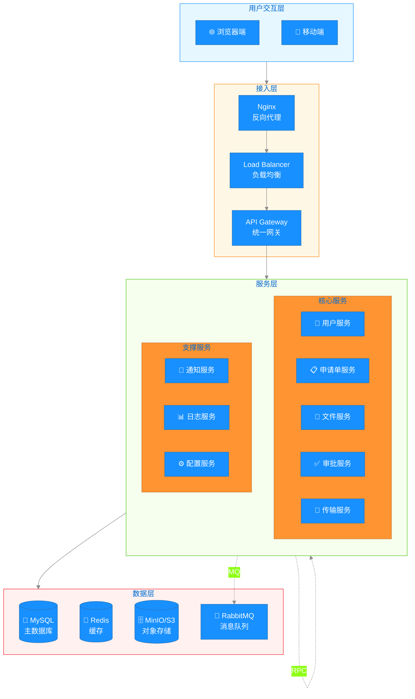
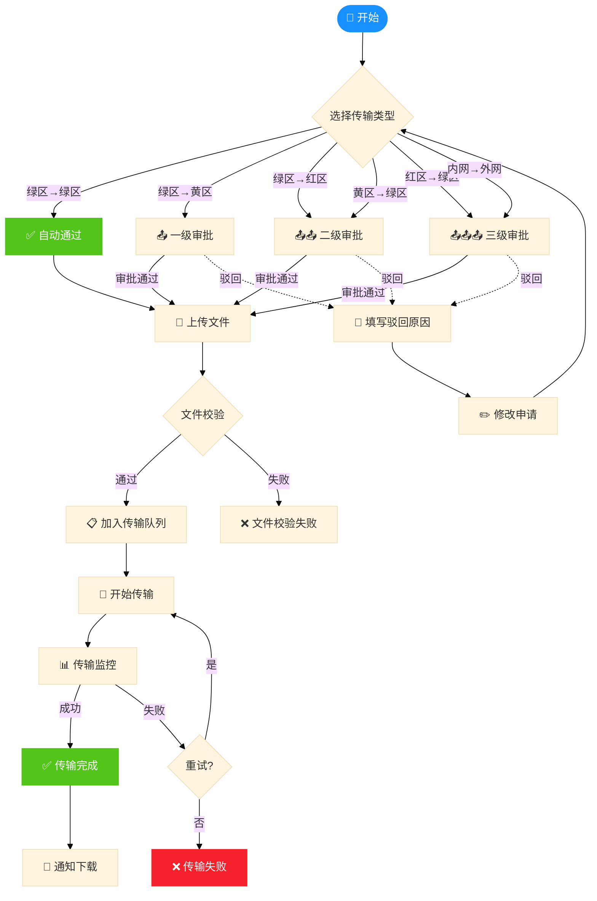
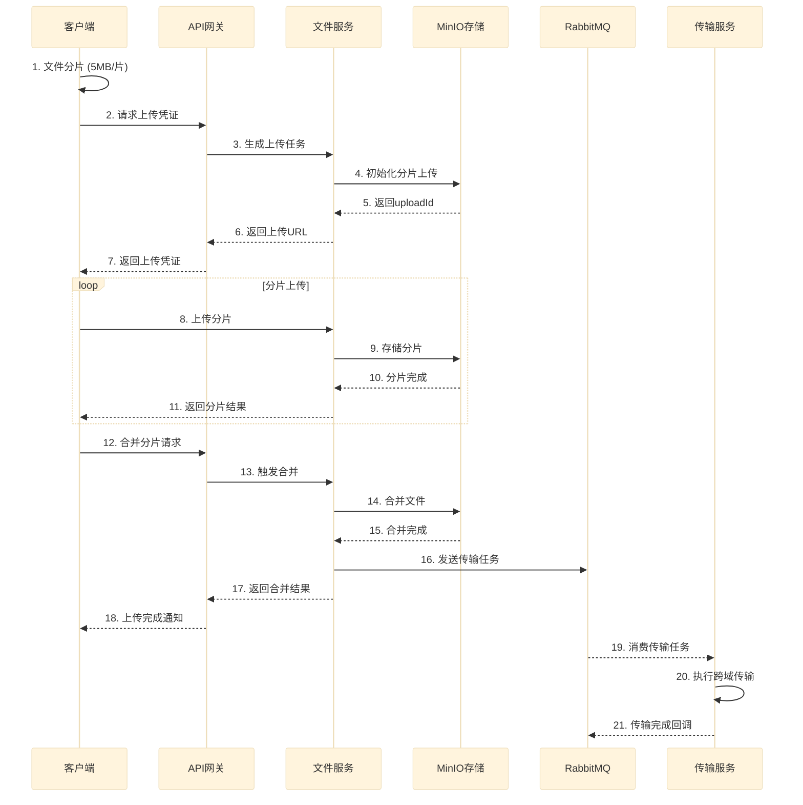
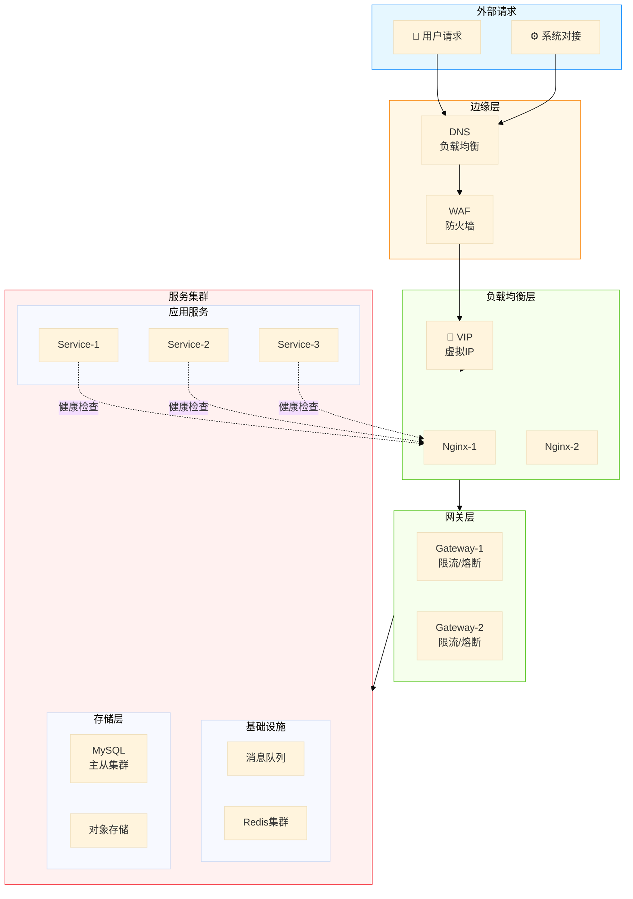
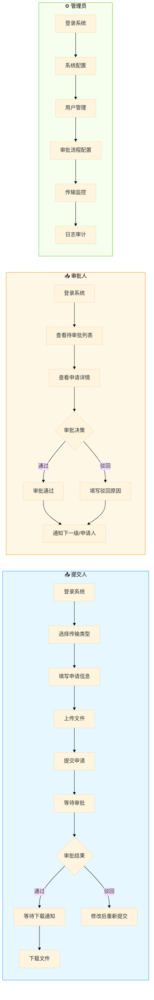
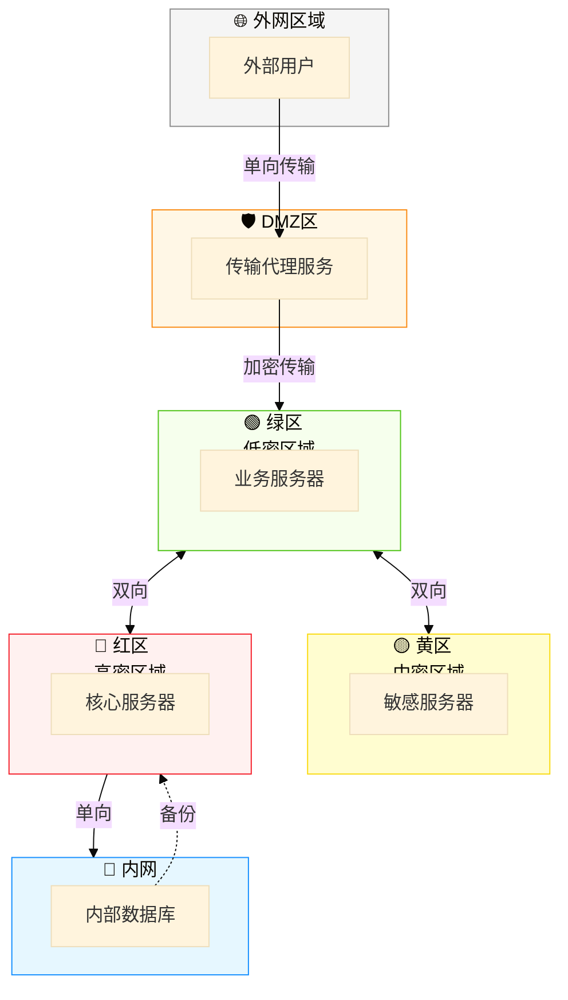

# 大文件传输平台 - 流程图集

**文档版本**: v1.0.0
**生成日期**: 2026-04-15
**适用范围**: 设计说明书补充文档

---

## 1. 系统整体架构图


**Mermaid 代码：**



**说明**：展示系统五层架构，从用户交互层到数据层的完整请求链路，以及服务间的 RPC 和 MQ 通信。

---

## 2. 角色权限图


**Mermaid 代码：**

```mermaid
%%{init: {'theme': 'base'}}%%
flowchart TB
    subgraph Roles["系统角色"]
        direction TB
        subgraph Admin["👑 管理员"]
            A1["系统配置管理"]
            A2["用户账号管理"]
            A3["审批流程配置"]
            A4["传输通道管理"]
            A5["日志审计管理"]
        end
        
        subgraph Approver["🎯 审批人"]
            B1["一级审批"]
            B2["二级审批"]
            B3["三级审批"]
        end
        
        subgraph User["👤 普通用户"]
            C1["提交传输申请"]
            C2["上传文件"]
            C3["下载文件"]
            C4["查看申请进度"]
        end
    end

    Admin --> Approver : 授权
    Admin --> User : 授权

    style Admin fill:#722ed1,stroke:#722ed1,color:#fff
    style Approver fill:#1890ff,stroke:#1890ff,color:#fff
    style User fill:#52c41a,stroke:#52c41a,color:#fff
```

**说明**：展示系统的三种核心角色及其对应的功能权限，体现 RBAC 权限模型。

---

## 3. 申请审批流程图


**Mermaid 代码：**



**说明**：展示从发起申请到传输完成的完整业务流程，包括不同传输类型的审批层级分支。

---

## 4. 文件分片传输时序图


**Mermaid 代码：**



**说明**：展示文件从分片上传、合并、到触发跨域传输的完整时序。

---

## 5. 负载均衡高可用架构图


**Mermaid 代码：**



**说明**：展示系统的高可用部署架构，包含边缘层、负载均衡层、网关层和服务集群。

---

## 6. 用户操作流程图



---

## 7. 安全域传输拓扑图



---

## 使用说明

### 嵌入到 Markdown 文档

1. 将上述 Mermaid 代码块直接复制到你的设计说明书 `.md` 文件中
2. 确保 Markdown 渲染器支持 Mermaid（如 GitHub、GitLab、飞书、语雀等）
3. 图片 placeholder 处可删除，不影响渲染

### 导出为图片

1. 访问 [Mermaid Live Editor](https://mermaid.live)
2. 粘贴 Mermaid 代码
3. 点击右上角 "Actions" → "PNG" 或 "SVG" 导出

### 调整样式

- 修改 `themeVariables` 中的颜色值可自定义配色
- 可选主题：`default`、`base`、`neutral`、`forest`、`dark`

---

**文档结束**
